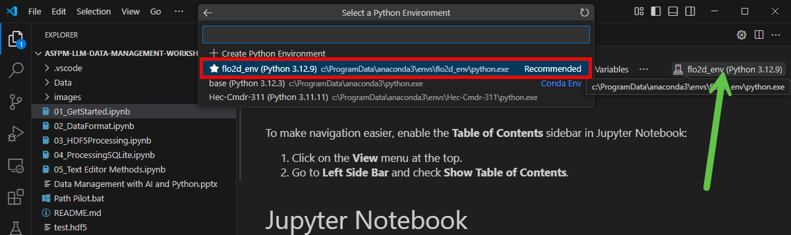

# ASFPM-LLM-Data-Management-Workshop

Videos with Setup instructions.
https://flo-2d.sharefile.com/d-s06c47ad1feb14b8ba2c8f584deb15ce2

Installation notes from meetting:
Install DB browser
Install HEC-RAS 6.6

## Welcome to the Workshop!

### Step 1: Install Anaconda
1. Download Anaconda from [anaconda.com](https://www.anaconda.com/products/individual).
2. Follow the installation steps for your operating system.

### Step 2: Create a Python Environment
1. Open Anaconda Navigator.
2. Go to the "Environments" tab on the left side.
3. Click on "Create" at the bottom of the environment list.
4. Name your environment (e.g., `workshop_env`) and select Python version 3.12 from the dropdown.
5. Click "Create".

### Step 3: Install Required Packages
After creating your environment, you need to install the required packages:
1. Make sure your new environment (`workshop_env`) is activated by clicking on it in the Anaconda Navigator.
2. Open a terminal in the Anaconda Navigator under your active environment.
3. Install the necessary packages by running:

```bash
   conda install pandas matplotlib h5py sqlite geopandas -c conda-forge
```

This command installs the packages from the Conda-Forge channel, which usually has up-to-date versions.

### Step 4: Install QGIS
1. Download QGIS from [qgis.org](https://qgis.org).
2. Follow the installation steps for your operating system.

### Step 5: Install HEC-RAS 6
1. Download HEC-RAS 6.6 from the [US Army Corps of Engineers website](https://www.hec.usace.army.mil/software/hec-ras/).
2. Follow the installation instructions provided on the website.
3. Ensure that the software is properly installed by opening it after installation.

### Step 6: Install DB Browser
1. Download DB Browser for SQLite from [sqlitebrowser.org](https://sqlitebrowser.org/).
2. Follow the installation steps for your operating system.
3. Open DB Browser to confirm the installation was successful.

### Step 7: Install Visual Studio Code
1. Download Visual Studio Code from [code.visualstudio.com](https://code.visualstudio.com).
2. Follow the installation steps for your operating system.
3. **Finish setup instrucions**

### Step 8: Load the Project VS Code
1. Run VS Code and use the File menu to Load the Project Folder. (ctrl-K-O)
2. Click 01_GetStarted.ipynb to load the first notebook.
3. Load Python Kernel.



### Step 9: Get Started with an AI Chat tool.

Any of these programs should work for this class. Create an account if necessary.  
A Paid account will cost around $20 per month. (Yes, they are worth the cost.)

1. **ChatGPT** – *by OpenAI*  
   Widely used conversational AI with strong natural language understanding and generation.

2. **Claude** – *by Anthropic*  
   Designed with a focus on safety and helpfulness. Known for long-context understanding and creative writing.

3. **Gemini** *by Google DeepMind*  
   Integrated with Google services. Good for general queries, coding help, and web search-based answers.

4. **CoPilot** *by Microsoft/OpenAI*  
   Embedded in Windows, Office, and Edge

**You're ready!** Open the first notebook *(Notebook 01_GetStarted.ipynb)* to begin.

---
